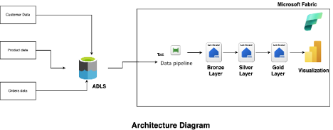

# Real World Project Case Study

## Overview

Binaryville is a multinational retail enterprise operating in 27 countries with more than 11,000 physical stores and a large scale e-commerce platform. The company generates massive volumes of data every day from transactions, customers, inventory systems, and regional operations.

Despite this data abundance, Binaryville struggles to consolidate and analyze information efficiently. This results in delayed insights, missed revenue opportunities, and operational inefficiencies across business units.

---

## Business Objectives

Binaryville requires a modern data platform capable of:

- Consolidating data from physical stores and online systems across multiple regions
- Processing large volumes of both historical and real time transactional data
- Delivering reliable enterprise wide analytics for decision making
- Scaling to support growth, acquisitions, and increased data velocity

---

## Data Sources

The platform must ingest and process three primary datasets:

### Customer Data
- Source: CRM system
- Format: CSV
- Frequency: Daily updates
- Volume: ~500 million records

### Product Catalog
- Source: Inventory management system
- Format: JSON
- Volume: ~1 million SKUs

### Transaction History
- Source: POS systems and e-commerce platforms
- Format: Parquet
- Volume: ~10 billion transactions annually

---

## Expected Outcomes

The solution aims to deliver measurable business value:

- Reduce total processing time from **72 hours → under 6 hours**
- Improve inventory forecasting accuracy by **25%**
- Increase repeat purchases by **15%** through personalization
- Enable real time financial reporting across all regions

---

## Key Challenges

Binaryville’s environment presents several technical and architectural challenges:

- Poor data quality in legacy and acquired datasets
- Inconsistent schemas and formats between regions
- Processing five years of historical data alongside daily loads
- Complex ETL requirements involving currency conversion, time zones, and regional product mappings
- Implementing new infrastructure without disrupting live operations

---

## Solution Architecture Using Microsoft Fabric

To address these requirements, we implement a **Lakehouse architecture** using Microsoft Fabric. This design separates data into logical layers for scalability, reliability, and governance.

---

### 1. Data Ingestion — Bronze Layer

Purpose: Store raw source data exactly as received.

Implementation:

- Automate daily ingestion of CSV, JSON, and Parquet files into the Lakehouse Bronze layer
- Use Fabric Pipelines for orchestration and scheduling
- Preserve original schemas for traceability and auditability

---

### 2. Data Processing — Silver Layer

Purpose: Clean, standardize, and validate data.

Transformations include:

- Schema harmonization across regions
- Currency normalization
- Time zone standardization
- Deduplication and null handling
- Validation against reference datasets

Technology:

- Microsoft Fabric Dataflows
- Fabric transformation activities
- Delta Lake storage for ACID transactions and schema evolution

---

### 3. Data Modeling — Gold Layer

Purpose: Deliver analytics ready datasets.

Design:

- Unified customer 360 dataset across regions
- Standardized product dimension
- Aggregated fact tables for sales and inventory

Consumption Layer:

- Fabric semantic model for business metrics
- Optimized tables for analytics performance

---

### 4. Batch Processing Strategy

Historical data is processed once using high compute clusters. Daily loads process only new data using incremental logic.

Implementation:

- Spark jobs running in Fabric Spark Engine
- Watermark based incremental ingestion
- Partitioned storage for performance optimization

---

### 5. Analytics and Reporting

Business teams access curated data through Power BI connected directly to Fabric.

Dashboards include:

- Sales performance by region
- Inventory trends and forecasts
- Financial summaries
- Customer segmentation insights

These dashboards refresh in near real time and support decision making across departments such as Finance, Marketing, Operations, and Supply Chain.

---

## Architectural Outcome

This architecture provides:

- Scalable data processing
- Centralized governance
- Faster analytics delivery
- Reliable enterprise reporting
- Future ready infrastructure

The result is a modern data platform capable of transforming Binaryville’s raw data into actionable intelligence at global scale.

# Data Lakehouse Architecture — High Level Solution

A data lakehouse combines the scalability of a data lake with the structure and performance of a data warehouse. It supports large scale storage, diverse data formats, transactional reliability, and analytical performance within a single architecture.

Core capabilities include:

- Elastic scalability for massive datasets
- Structured data management and ACID transactions
- Support for structured, semi structured, and unstructured data
- Unified platform for batch, streaming, and analytical workloads

For Binaryville, this architecture allows the platform to process extremely large and diverse datasets while still enforcing the consistency and performance required for real time analytics and enterprise reporting. Microsoft Fabric enables this by integrating storage, compute, orchestration, and analytics into one environment.

---

## Three Layer Architecture Design

The solution follows a standard medallion architecture composed of Bronze, Silver, and Gold layers. Each layer has a distinct responsibility and progressively improves data quality and usability.

---

### Bronze Layer — Raw Data Ingestion

Purpose: Store source data exactly as received.

- Ingest CSV, JSON, and Parquet files into Lakehouse storage
- Convert files into Delta table format
- Preserve full historical data for traceability and reprocessing
- Maintain original schema and structure

This layer serves as the system of record and ensures reproducibility of downstream transformations.

---

### Silver Layer — Cleaned and Conformed Data

Purpose: Standardize and validate data.

- Apply data quality rules such as deduplication, null handling, and schema alignment
- Standardize currencies, timestamps, and regional formats
- Resolve inconsistencies between datasets
- Implement transformations using Microsoft Fabric Notebooks and Spark

This layer produces reliable, analytics ready data without raw system noise.

---

### Gold Layer — Business Ready Aggregates

Purpose: Deliver optimized datasets for reporting and decision making.

- Apply business logic and aggregations
- Create dimensional models and curated tables
- Optimize storage and queries using Lakehouse performance features
- Prepare data for semantic models and dashboards

This layer is designed specifically for analytics consumption and high performance querying.

---

## Architectural Benefits

This layered approach provides:

- Strong data integrity through separation of concerns
- Clear lineage from raw source to final report
- Easier debugging and auditing
- Scalability for future growth
- Faster query performance for analytics users

By progressively refining data across layers, the architecture ensures that raw data remains preserved while business users interact only with trusted, high quality datasets.

# Fabric End to End Project Architecture Diagram

The project architecture consists of multiple data sources including customer data, product data, and order data. These datasets are ingested into Azure Data Lake Storage, where they are processed through a structured pipeline that organizes data into Bronze, Silver, and Gold layers. The final curated data is then used for visualization and analytics.

Microsoft Fabric provides an integrated platform that supports the entire workflow. Data pipelines, Spark notebooks, and visualization tools all operate within the same environment, allowing every stage of the architecture to be managed, executed, and monitored in a unified system.

# Fabric Workspace Creation

In this section, we walk through the process of creating a Microsoft Fabric workspace for Binaryville’s data lakehouse solution. The workspace serves as the core environment where all data engineering, analytics, and reporting activities will be developed and managed.

---

### Prerequisite

Before creating the workspace, ensure you have:

- An active Microsoft Fabric subscription or trial

---

### Step 1: Log in to Microsoft Fabric

Open the Microsoft Fabric portal and sign in using your Azure credentials with the required permissions.

---

### Step 2: Navigate to Workspaces

After logging in, select **Workspaces** from the left navigation menu. This section displays all existing workspaces and allows you to manage or create new ones.

---

### Step 3: Create a New Workspace

1. Click **Create Workspace**
2. Enter a workspace name  
   Example: `Binaryville`
3. Enter a description  
   Example: `Binaryville Lakehouse`

Once saved, the workspace will be created and ready for use within Microsoft Fabric.
